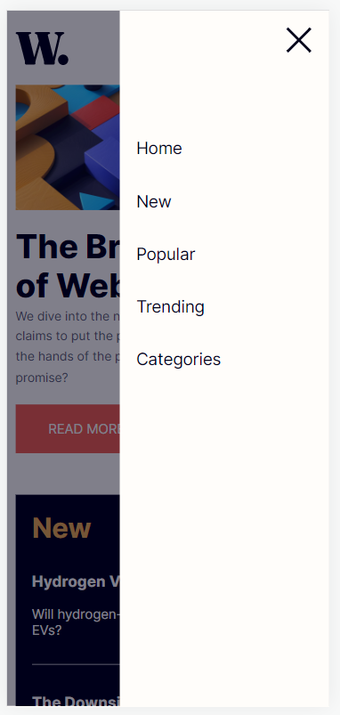
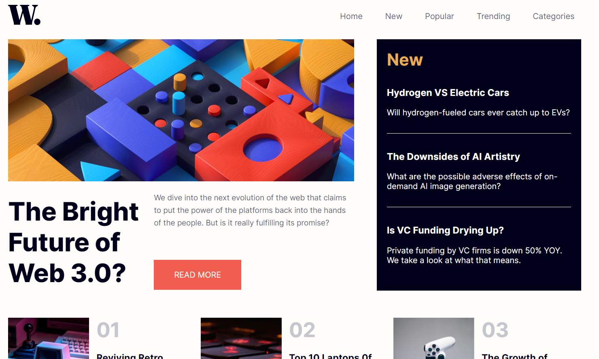

# Frontend Mentor - News homepage solution

This is a solution to the [News homepage challenge on Frontend Mentor](https://www.frontendmentor.io/challenges/news-homepage-H6SWTa1MFl). Frontend Mentor challenges help you improve your coding skills by building realistic projects.

## Table of contents

- [Overview](#overview)
  - [The challenge](#the-challenge)
  - [Screenshot](#screenshot)
  - [Links](#links)
- [My process](#my-process)
  - [Built with](#built-with)
  - [What I learned](#what-i-learned)
  - [Continued development](#continued-development)
  - [Useful resources](#useful-resources)
- [Author](#author)

## Overview

### The challenge

Users should be able to:

- View the optimal layout for the interface depending on their device's screen size
- See hover and focus states for all interactive elements on the page

### Screenshot





### Links

- Live Site URL: [Vercel](https://news-homepage-winstein27.vercel.app/)

## My process

### Built with

- Semantic HTML5 markup
- CSS custom properties
- CSS Box Model

### What I learned

In this project, I learnet how to build websites using only HTML, CSS and JavaScript, without any framework or libraries. The responsive layout was a challenge, learning that was really exciting.

Here are some code snipets:

```css
@media (min-width: 700px) {
  .header-menu {
    display: none;
  }
}
```

```js
const openMenu = () => {
  backdrop.style.display = 'block';
  mobileMenu.style.display = 'block';
};

const closeMenu = () => {
  backdrop.style.display = 'none';
  mobileMenu.style.display = 'none';
};
```

### Continued development

I need to improve CSS skills, use mobile first approach and modern CSS sizes.

### Useful resources

- [Fullscreen overlay](https://www.w3schools.com/howto/howto_js_fullscreen_overlay.asp) - This helped building the overlayed mobile menu.
- [CSS - The Complete Guide 2023](https://www.udemy.com/course/css-the-complete-guide-incl-flexbox-grid-sass/) - This is an amazing CSS course that I'm doing to improve my skills.

## Author

- LinkedIn - [Winstein Martins](https://www.linkedin.com/in/winstein-martins/)
- Frontend Mentor - [@winstein27](https://www.frontendmentor.io/profile/winstein27)
